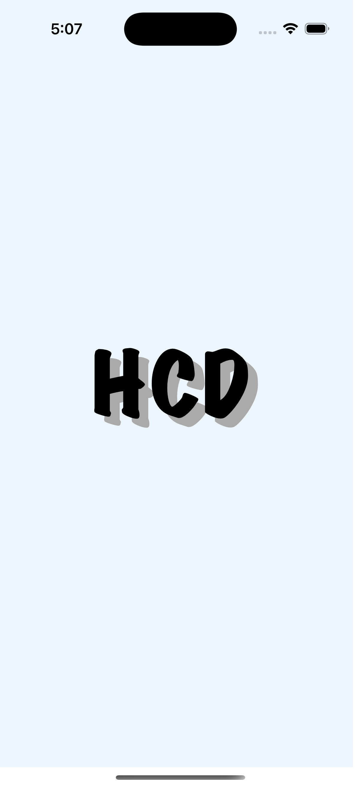
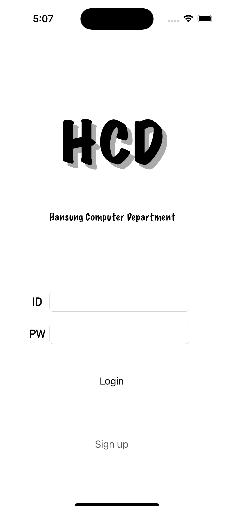
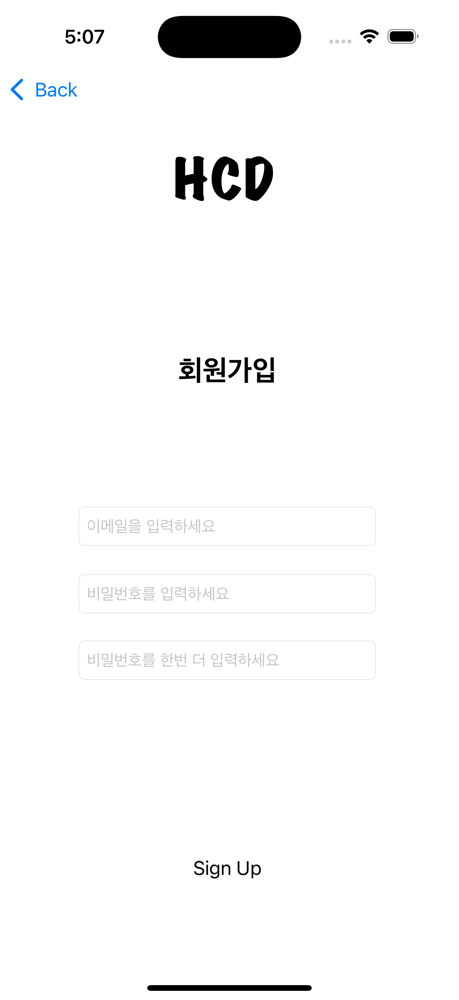
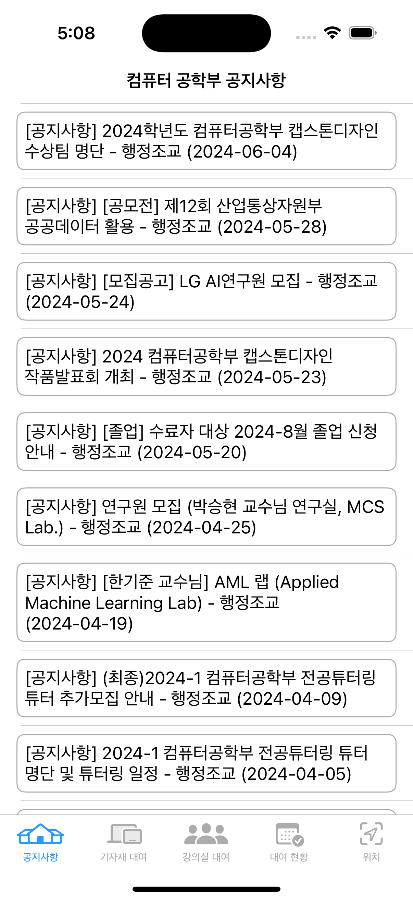
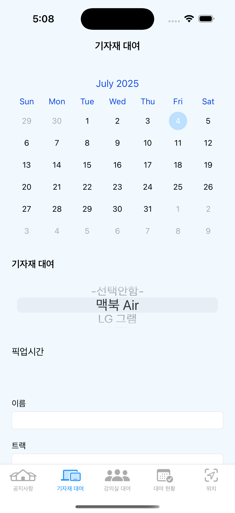
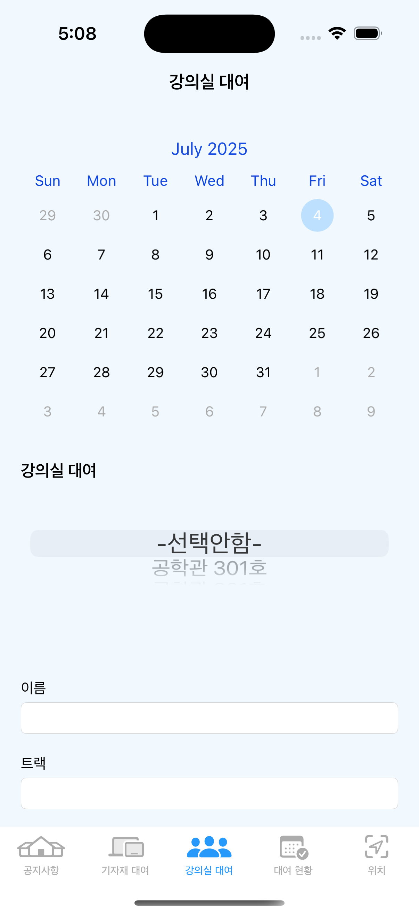
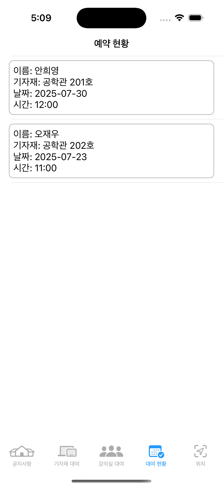
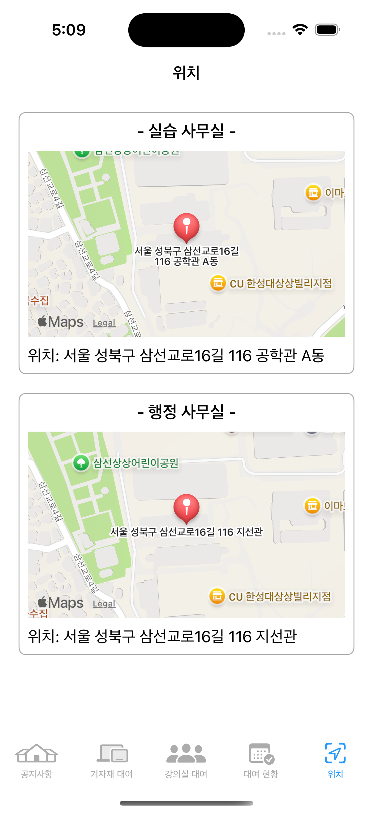

# 🎓 HCD Application iOS

> **한성대학교 컴퓨터공학부를 위한 통합 관리 iOS 애플리케이션**

<div align="center">


</div>

## 📱 프로젝트 소개

**HCD Application**은 한성대학교 컴퓨터공학부 학생들을 위한 올인원 모바일 솔루션입니다. 장비 대여, 강의실 예약, 공지사항 확인 등 학과 생활에 필요한 모든 기능을 하나의 앱에서 제공합니다.

### ✨ 주요 기능

- 🔐 **사용자 인증**: Firebase Authentication을 통한 안전한 로그인/회원가입
- 💻 **장비 대여**: 노트북, 태블릿 등 학과 장비 대여 신청 및 관리
- 🏫 **강의실 예약**: 세미나룸, 프로젝트룸 등 강의실 예약 시스템
- 📋 **대여 현황**: 실시간 대여 상태 확인 및 반납 관리
- 📢 **공지사항**: 학과 공지사항 및 중요 알림 확인
- 📍 **위치 정보**: 캠퍼스 내 시설 위치 안내
- 📅 **예약 상세**: 예약 내역 상세 보기 및 관리

## 🛠️ 기술 스택

### Frontend
- **Language**: Swift 5.0+
- **UI Framework**: UIKit
- **Architecture**: MVC Pattern
- **Dependency Manager**: CocoaPods

### Backend & Database
- **Authentication**: Firebase Authentication
- **Database**: Firebase Firestore
- **Cloud Storage**: Firebase Storage
- **Push Notifications**: Firebase Cloud Messaging

### Third-Party Libraries
- **Firebase SDK**: 사용자 인증, 데이터베이스, 스토리지
- **FSCalendar**: 캘린더 UI 구성
- **기타 라이브러리**: [Podfile](./Podfile) 참조

## 📋 시스템 요구사항

- **iOS**: 13.0+
- **Xcode**: 12.0+
- **Swift**: 5.0+
- **CocoaPods**: 1.10.0+

## 🚀 설치 및 실행

### 1. 저장소 클론
```bash
git clone https://github.com/jaewoooh/HCD_Application_ios.git
cd HCD_Application_ios
```

### 2. 의존성 설치
```bash
# CocoaPods 설치 (없는 경우)
sudo gem install cocoapods

# 의존성 설치
pod install
```

### 3. Firebase 설정
1. [Firebase Console](https://console.firebase.google.com/)에서 새 프로젝트 생성
2. iOS 앱 추가 및 `GoogleService-Info.plist` 파일 다운로드
3. 다운로드한 파일을 프로젝트 루트 디렉토리에 추가
4. Xcode에서 프로젝트에 파일 추가

### 4. 프로젝트 실행
```bash
# .xcworkspace 파일로 열기 (CocoaPods 사용 시 필수)
open ComputerDepartment.xcworkspace
```

## 🏗️ 프로젝트 구조

```
ComputerDepartment/
├── 📁 ComputerDepartment/                   # 메인 소스 폴더
│   ├── 📱 AppDelegate.swift                 # 앱 델리게이트
│   ├── 🔧 SceneDelegate.swift               # 씬 델리게이트
│   ├── 🔥 FirebaseManager.swift             # Firebase 연동 관리
│   ├── 🎨 Main.storyboard                   # 메인 스토리보드
│   ├── 🚀 LaunchScreen.storyboard          # 런치 스크린
│   ├── 📋 Info.plist                       # 앱 정보
│   ├── 🔐 LoginViewController.swift         # 로그인 화면
│   ├── 📝 SignUpViewController.swift        # 회원가입 화면
│   ├── 📊 UITabBarControllerViewController.swift # 탭바 컨트롤러
│   ├── 🏠 HomeController.swift              # 메인 홈 화면
│   ├── 📢 NoticeDetailController.swift      # 공지사항 상세
│   ├── 💻 EquipmentRentalController.swift   # 장비 대여 관리
│   ├── 🏫 RoomRentalController.swift        # 강의실 예약 관리
│   ├── 📋 RentalStatusController.swift      # 대여 현황 관리
│   ├── 📊 RentalStatusCell.swift           # 대여 현황 셀
│   ├── 📅 ReservationDetailViewController.swift # 예약 상세
│   ├── 📍 LocationController.swift          # 위치 정보
│   ├── 🖼️ Assets.xcassets/                 # 이미지 및 색상 리소스
│   └── 🔒 GoogleService-Info.plist         # Firebase 설정 (gitignore)
├── 📁 Products/                             # 빌드 결과물
├── 📁 Frameworks/                           # 프레임워크
└── 📦 Podfile                               # CocoaPods 의존성 관리
```

## 📸 스크린샷

<div align="center">

| 런치스크린 | 로그인 | 회원가입 | 홈화면 |
|----------|--------|---------|--------|
|  |  |  |  |

| 장비 대여 | 강의실 대여 | 대여 현황 | 지도 |
|----------|-----------|---------|------|
|  |  |  |  |

</div>

## 🤝 기여하기

프로젝트에 기여하고 싶으시다면:

1. 이 저장소를 Fork 합니다
2. 새로운 기능 브랜치를 만듭니다 (`git checkout -b feature/AmazingFeature`)
3. 변경사항을 커밋합니다 (`git commit -m 'Add some AmazingFeature'`)
4. 브랜치에 Push 합니다 (`git push origin feature/AmazingFeature`)
5. Pull Request를 생성합니다


## 👨‍💻 개발자

**재우** - [jaewoooh](https://github.com/jaewoooh)

- 📧 Email: jae990508@gmail.com

---

## 📚 관련 링크

- [Firebase 문서](https://firebase.google.com/docs)
- [iOS 개발 가이드](https://developer.apple.com/ios/)
- [Swift 프로그래밍 가이드](https://docs.swift.org/swift-book/)
- [CocoaPods 가이드](https://guides.cocoapods.org/)

---
